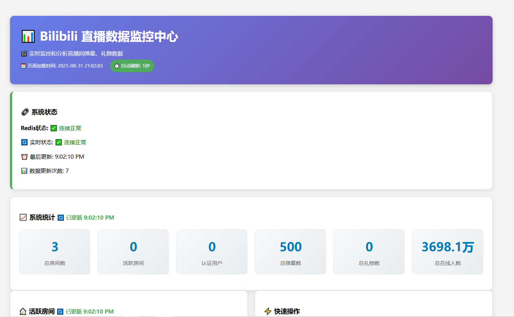
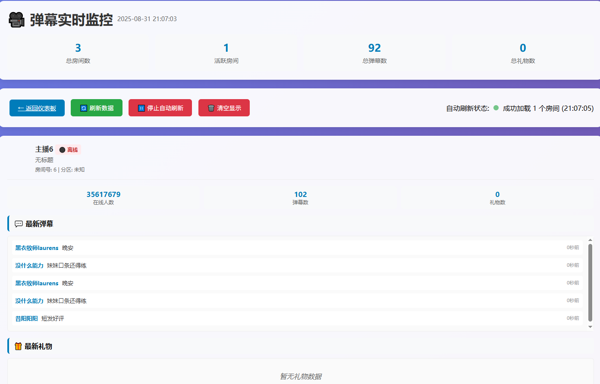
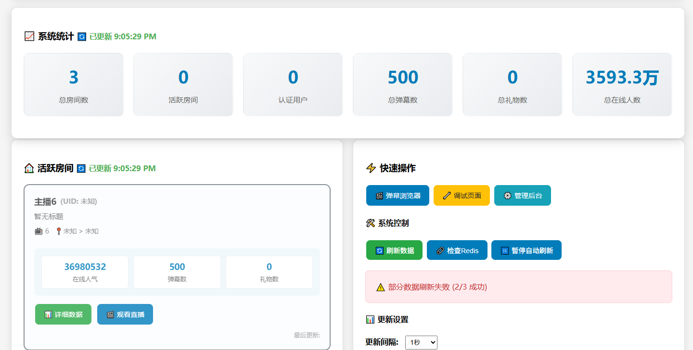
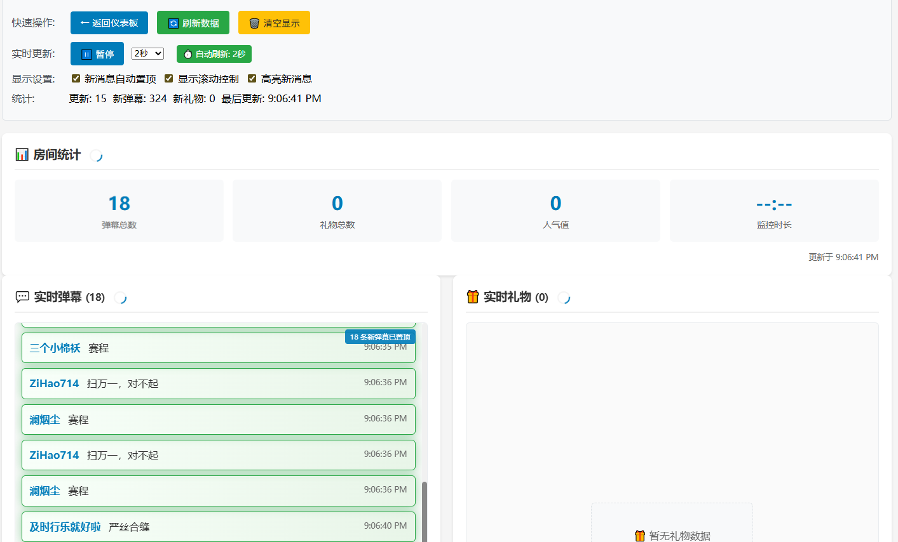
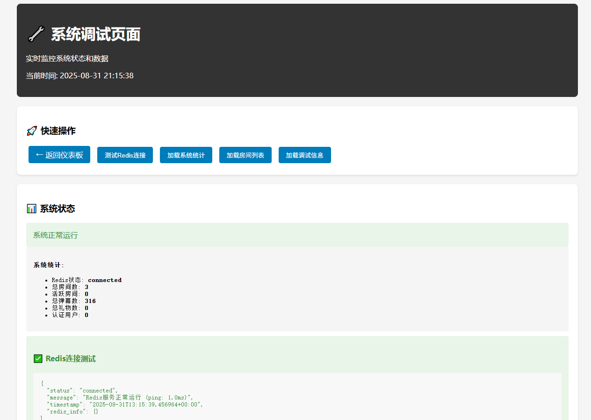
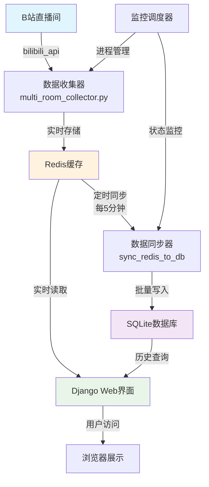
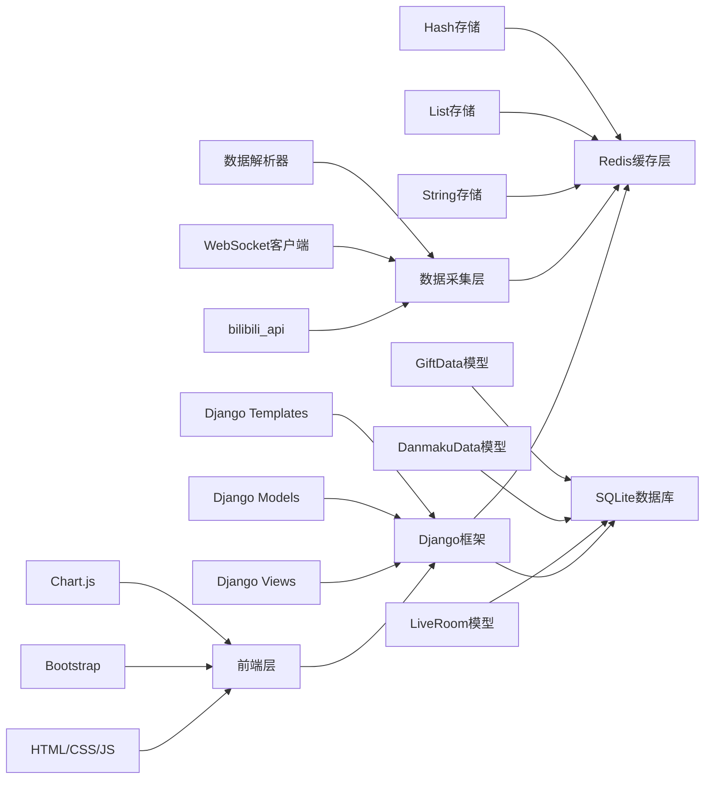
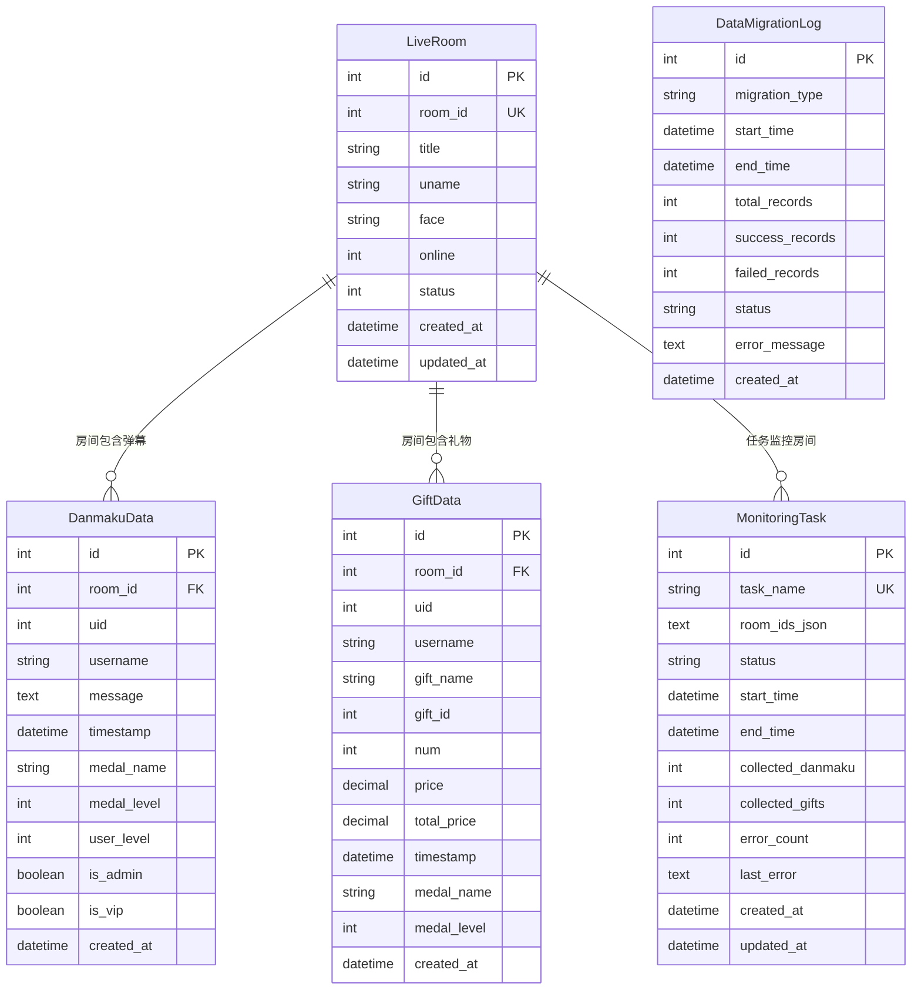

# B站直播数据实时监控系统

一个基于Django和Redis的B站直播间数据实时监控系统，支持多房间同时监控、实时弹幕采集、礼物统计和数据可视化。

## 🌟 功能特性

- 🎯 **多房间监控** - 同时监控多个直播间数据
- 💬 **实时弹幕采集** - 实时获取和展示弹幕内容
- 🎁 **礼物统计分析** - 统计礼物数量、价值和趋势
- 📊 **数据可视化** - Django Web界面展示实时数据
- 💾 **高性能存储** - Redis缓存确保数据快速访问
- ⚡ **实时更新** - 自动刷新和WebSocket实时推送
- 🔄 **自动重启** - 服务异常时自动恢复
- 🛠️ **调试工具** - 完整的调试和监控工具

## 📸 实际运行效果展示

### 🏠 主仪表板
> 系统总览界面，展示所有监控房间的实时统计数据和状态



### 💬 弹幕浏览器
> 实时弹幕查看和搜索界面，支持多房间切换和实时更新



### 📊 数据统计图表
> 实时数据可视化图表，展示弹幕和礼物数据趋势



### 🏠 房间详情页面
> 单个房间的详细信息和实时数据展示



### 🔧 系统调试页面
> 系统状态监控和调试信息界面




## 🏗️ 系统架构与实现流程

### 核心流程图



### 详细实现流程

#### 1. 数据采集阶段
```
B站API ➜ bilibili_api库 ➜ WebSocket连接 ➜ 实时数据流
   ↓
解析数据包 ➜ 提取弹幕/礼物信息 ➜ 格式化数据结构
   ↓
Redis存储 ➜ 按房间分类存储 ➜ 设置数据过期时间
```

#### 2. 实时展示阶段
```
Django视图 ➜ Redis查询 ➜ 数据格式化 ➜ 模板渲染
   ↓
JavaScript轮询 ➜ AJAX请求 ➜ 动态更新页面内容
   ↓
图表库渲染 ➜ 实时统计图表 ➜ 用户界面展示
```

#### 3. 数据持久化阶段
```
定时任务 ➜ Redis数据读取 ➜ 批量数据处理
   ↓
数据验证 ➜ 去重处理 ➜ 数据库事务写入
   ↓
清理Redis ➜ 日志记录 ➜ 状态更新
```

### 技术栈架构



## 📊 数据库逻辑结构

### Redis数据结构

```
Redis Keys组织结构:
├── room:{room_id}:info          # 房间基本信息 (Hash)
│   ├── title: "直播间标题"
│   ├── uname: "主播名称"
│   ├── online: "在线人数"
│   └── status: "直播状态"
│
├── room:{room_id}:danmaku       # 弹幕数据 (List)
│   ├── [0] {"uid": 123, "username": "用户1", "message": "弹幕内容", "timestamp": 1699123456}
│   ├── [1] {"uid": 456, "username": "用户2", "message": "弹幕内容", "timestamp": 1699123457}
│   └── ...
│
├── room:{room_id}:gifts         # 礼物数据 (List)
│   ├── [0] {"uid": 789, "gift_name": "小心心", "num": 1, "price": 0.1, "timestamp": 1699123458}
│   ├── [1] {"uid": 101, "gift_name": "热气球", "num": 5, "price": 50.0, "timestamp": 1699123459}
│   └── ...
│
└── room:{room_id}:stats         # 统计信息 (Hash)
    ├── total_danmaku: "1234"
    ├── total_gifts: "56"
    ├── total_users: "789"
    └── last_update: "1699123460"
```

### SQLite数据库结构

```sql
-- 直播间基本信息表
CREATE TABLE live_data_liveroom (
    id INTEGER PRIMARY KEY AUTOINCREMENT,
    room_id INTEGER UNIQUE NOT NULL,           -- 房间ID
    title VARCHAR(200) NOT NULL,               -- 直播间标题
    uname VARCHAR(100) NOT NULL,               -- 主播用户名
    face VARCHAR(500),                         -- 主播头像URL
    online INTEGER DEFAULT 0,                 -- 在线人数
    status INTEGER DEFAULT 0,                 -- 直播状态 (0:未开播, 1:直播中, 2:轮播)
    created_at DATETIME DEFAULT CURRENT_TIMESTAMP,
    updated_at DATETIME DEFAULT CURRENT_TIMESTAMP
);

-- 弹幕数据表
CREATE TABLE live_data_danmakudata (
    id INTEGER PRIMARY KEY AUTOINCREMENT,
    room_id INTEGER NOT NULL,                 -- 关联房间ID
    uid INTEGER NOT NULL,                     -- 用户UID
    username VARCHAR(50) NOT NULL,            -- 用户名
    message TEXT NOT NULL,                    -- 弹幕内容
    timestamp DATETIME NOT NULL,              -- 发送时间
    medal_name VARCHAR(50),                   -- 粉丝牌名称
    medal_level INTEGER DEFAULT 0,           -- 粉丝牌等级
    user_level INTEGER DEFAULT 0,            -- 用户等级
    is_admin BOOLEAN DEFAULT FALSE,           -- 是否管理员
    is_vip BOOLEAN DEFAULT FALSE,             -- 是否VIP
    created_at DATETIME DEFAULT CURRENT_TIMESTAMP,
    FOREIGN KEY (room_id) REFERENCES live_data_liveroom (room_id)
);

-- 礼物数据表
CREATE TABLE live_data_giftdata (
    id INTEGER PRIMARY KEY AUTOINCREMENT,
    room_id INTEGER NOT NULL,                 -- 关联房间ID
    uid INTEGER NOT NULL,                     -- 用户UID
    username VARCHAR(50) NOT NULL,            -- 用户名
    gift_name VARCHAR(100) NOT NULL,          -- 礼物名称
    gift_id INTEGER NOT NULL,                 -- 礼物ID
    num INTEGER DEFAULT 1,                   -- 礼物数量
    price DECIMAL(10,2) DEFAULT 0.00,        -- 单价
    total_price DECIMAL(10,2) DEFAULT 0.00,  -- 总价
    timestamp DATETIME NOT NULL,              -- 送礼时间
    medal_name VARCHAR(50),                   -- 粉丝牌名称
    medal_level INTEGER DEFAULT 0,           -- 粉丝牌等级
    created_at DATETIME DEFAULT CURRENT_TIMESTAMP,
    FOREIGN KEY (room_id) REFERENCES live_data_liveroom (room_id)
);

-- 监控任务表
CREATE TABLE live_data_monitoringtask (
    id INTEGER PRIMARY KEY AUTOINCREMENT,
    task_name VARCHAR(100) UNIQUE NOT NULL,   -- 任务名称
    room_ids_json TEXT,                       -- 监控房间ID列表(JSON格式)
    status VARCHAR(20) DEFAULT 'stopped',     -- 任务状态
    start_time DATETIME,                      -- 开始时间
    end_time DATETIME,                        -- 结束时间
    collected_danmaku INTEGER DEFAULT 0,     -- 收集弹幕数
    collected_gifts INTEGER DEFAULT 0,       -- 收集礼物数
    error_count INTEGER DEFAULT 0,           -- 错误次数
    last_error TEXT,                         -- 最后错误信息
    created_at DATETIME DEFAULT CURRENT_TIMESTAMP,
    updated_at DATETIME DEFAULT CURRENT_TIMESTAMP
);

-- 数据同步日志表
CREATE TABLE live_data_datamigrationlog (
    id INTEGER PRIMARY KEY AUTOINCREMENT,
    migration_type VARCHAR(50) NOT NULL,      -- 同步类型
    start_time DATETIME NOT NULL,             -- 开始时间
    end_time DATETIME,                        -- 结束时间
    total_records INTEGER DEFAULT 0,         -- 总记录数
    success_records INTEGER DEFAULT 0,       -- 成功记录数
    failed_records INTEGER DEFAULT 0,        -- 失败记录数
    status VARCHAR(20) DEFAULT 'running',    -- 同步状态
    error_message TEXT,                       -- 错误信息
    created_at DATETIME DEFAULT CURRENT_TIMESTAMP
);

-- 索引优化
CREATE INDEX idx_danmaku_room_timestamp ON live_data_danmakudata(room_id, timestamp);
CREATE INDEX idx_danmaku_uid ON live_data_danmakudata(uid);
CREATE INDEX idx_gift_room_timestamp ON live_data_giftdata(room_id, timestamp);
CREATE INDEX idx_gift_uid ON live_data_giftdata(uid);
CREATE INDEX idx_migration_status ON live_data_datamigrationlog(status, start_time);
```

### 数据关系图



## 🔄 数据流转详细说明

### 1. 实时数据采集流程

```python
# 数据采集伪代码
async def collect_room_data(room_id):
    """实时采集指定房间数据"""
    
    # 1. 建立WebSocket连接
    room = live.LiveRoom(room_display_id=room_id)
    
    # 2. 注册事件处理器
    @room.on('DANMU_MSG')
    async def on_danmaku(event):
        danmaku_data = {
            'room_id': room_id,
            'uid': event['data']['info'][2][0],
            'username': event['data']['info'][2][1],
            'message': event['data']['info'][1],
            'timestamp': time.time()
        }
        # 存储到Redis
        redis_client.lpush(f'room:{room_id}:danmaku', 
                          json.dumps(danmaku_data))
    
    @room.on('SEND_GIFT')
    async def on_gift(event):
        gift_data = {
            'room_id': room_id,
            'uid': event['data']['uid'],
            'username': event['data']['uname'],
            'gift_name': event['data']['giftName'],
            'num': event['data']['num'],
            'price': event['data']['price'],
            'timestamp': time.time()
        }
        # 存储到Redis
        redis_client.lpush(f'room:{room_id}:gifts', 
                          json.dumps(gift_data))
    
    # 3. 启动监听
    await room.connect()
```

### 2. 数据同步机制

```python
# 数据同步伪代码
class DataSynchronizer:
    """数据同步器"""
    
    def sync_danmaku_data(self, room_id):
        """同步弹幕数据"""
        # 1. 从Redis获取数据
        danmaku_list = redis_client.lrange(
            f'room:{room_id}:danmaku', 0, 1000
        )
        
        # 2. 批量处理数据
        batch_data = []
        for danmaku_json in danmaku_list:
            danmaku_data = json.loads(danmaku_json)
            batch_data.append(
                DanmakuData(**danmaku_data)
            )
        
        # 3. 批量写入数据库
        with transaction.atomic():
            DanmakuData.objects.bulk_create(
                batch_data, ignore_conflicts=True
            )
        
        # 4. 清理Redis数据
        redis_client.ltrim(f'room:{room_id}:danmaku', 1000, -1)
    
    def schedule_sync(self, interval=300):
        """定时同步任务"""
        while True:
            try:
                # 获取所有监控房间
                room_ids = self.get_monitored_rooms()
                
                # 逐个同步
                for room_id in room_ids:
                    self.sync_danmaku_data(room_id)
                    self.sync_gift_data(room_id)
                
                # 记录同步日志
                self.log_sync_status('success')
                
            except Exception as e:
                self.log_sync_status('failed', str(e))
            
            time.sleep(interval)
```

### 3. Web界面数据展示

```python
# Django视图伪代码
class DashboardView(View):
    """仪表板视图"""
    
    def get(self, request):
        # 1. 获取实时统计
        stats = self.get_realtime_stats()
        
        # 2. 获取活跃房间
        active_rooms = self.get_active_rooms()
        
        # 3. 获取趋势数据
        trend_data = self.get_trend_data()
        
        context = {
            'stats': stats,
            'active_rooms': active_rooms,
            'trend_data': trend_data
        }
        return render(request, 'dashboard.html', context)
    
    def get_realtime_stats(self):
        """获取实时统计数据"""
        stats = {}
        
        # Redis实时数据
        for room_id in self.get_monitored_rooms():
            danmaku_count = redis_client.llen(
                f'room:{room_id}:danmaku'
            )
            gift_count = redis_client.llen(
                f'room:{room_id}:gifts'
            )
            stats[room_id] = {
                'danmaku_count': danmaku_count,
                'gift_count': gift_count
            }
        
        return stats
```

## 📋 系统要求

- **Python**: 3.8 或更高版本
- **Redis**: 6.0 或更高版本
- **操作系统**: Windows/Linux/macOS
- **内存**: 建议 4GB 以上
- **网络**: 稳定的互联网连接

## 🚀 快速开始

### 1. 克隆项目

```bash
git clone https://github.com/YOUR_USERNAME/bilibili-live-monitor.git
cd bilibili-live-monitor
```

### 2. 安装依赖

```bash
# 安装Python依赖
pip install -r requirements.txt

# 或使用conda
conda install --file requirements.txt
```

### 3. 启动Redis服务

```bash
# Windows (使用chocolatey)
choco install redis-64
redis-server

# Linux (Ubuntu/Debian)
sudo apt-get install redis-server
sudo systemctl start redis

# macOS (使用homebrew)
brew install redis
brew services start redis
```

### 4. 配置Django

```bash
cd bilibili-live-monitor-django

# 数据库迁移
python manage.py migrate

# 创建超级用户（可选）
python manage.py createsuperuser

# 收集静态文件
python manage.py collectstatic
```

### 5. 启动系统

#### 方式一：一键启动（推荐）

```bash
# 返回项目根目录
cd ..

# 一键启动所有服务
python setup.py
```

启动效果如下：


#### 方式二：分别启动

```bash
# 终端1：启动数据收集器
cd web_version
python multi_room_collector.py

# 终端2：启动Django服务器
cd bilibili-live-monitor-django
python manage.py runserver 0.0.0.0:8000
```

### 6. 访问系统

打开浏览器访问以下地址：

- 🏠 **主页面**: http://localhost:8000/live/
- 📊 **数据仪表板**: http://localhost:8000/live/dashboard/
- 💬 **弹幕浏览器**: http://localhost:8000/live/danmaku/
- 🔧 **调试页面**: http://localhost:8000/live/debug/

## 📁 项目结构

```
bilibili-live-monitor/
├── bilibili-live-monitor-django/     # Django Web应用
│   ├── bilibili_monitor/             # Django项目配置
│   ├── live_data/                    # 主应用模块
│   │   ├── templates/                # HTML模板
│   │   ├── static/                   # 静态文件
│   │   ├── management/               # Django管理命令
│   │   └── ...
│   ├── utils/                        # 工具类库
│   ├── static/                       # 全局静态文件
│   ├── logs/                         # 日志文件
│   └── manage.py                     # Django管理脚本
├── web_version/                      # 数据收集器
│   ├── multi_room_collector.py       # 多房间收集器
│   ├── simple_redis_saver.py         # Redis数据保存器
│   └── ...
├── docs/                             # 文档和图片
│   └── images/                       # 界面截图
├── live_data/                        # 历史数据和工具
├── spider_live_data/                 # 数据分析工具
├── setup.py                         # 一键启动脚本
├── requirements.txt                  # Python依赖
└── README.md                         # 项目说明
```

## ⚙️ 配置说明

### 监控房间配置

编辑 `web_version/multi_room_collector.py` 中的房间ID列表：

```python
# 默认监控的房间ID
DEFAULT_ROOMS = [
    1962481108,  # 房间1
    1982728080,  # 房间2
    1959064353,  # 房间3
    # 添加更多房间ID...
]
```

### Redis配置

编辑 `utils/redis_config.py`：

```python
REDIS_CONFIG = {
    'host': 'localhost',
    'port': 6379,
    'db': 0,
    'decode_responses': True,
    'max_connections': 50
}
```

### Django配置

编辑 `bilibili_monitor/settings.py`：

```python
# 数据库配置
DATABASES = {
    'default': {
        'ENGINE': 'django.db.backends.sqlite3',
        'NAME': BASE_DIR / 'db.sqlite3',
    }
}

# Redis配置
CACHES = {
    'default': {
        'BACKEND': 'django_redis.cache.RedisCache',
        'LOCATION': 'redis://127.0.0.1:6379/0',
    }
}
```

## 🔧 高级使用

### 自定义监控房间

```bash
# 监控指定房间
python setup.py --rooms 1962481108,1982728080,1959064353

# 使用配置文件
python setup.py --config custom_config.json
```

### 仅启动特定服务

```bash
# 仅启动Django
python setup.py --django-only

# 仅启动数据收集器
python setup.py --collector-only
```

### 使用API

系统提供RESTful API接口：

```bash
# 获取房间弹幕数据
curl http://localhost:8000/live/api/room/1962481108/danmaku/

# 获取房间礼物数据
curl http://localhost:8000/live/api/room/1962481108/gifts/

# 获取房间统计信息
curl http://localhost:8000/live/api/room/1962481108/stats/
```

### 调试模式

```bash
# 启用详细调试信息
python setup.py --no-background --status-display

# 查看Redis数据
python manage.py shell
>>> from utils.redis_handler import get_redis_client
>>> client = get_redis_client()
>>> client.keys('room:*')
```

## 🐛 故障排除

### 常见问题

**Q: 收集器进程经常停止**
```bash
# 检查Redis连接
redis-cli ping

# 查看错误日志
tail -f logs/collector.log

# 使用调试模式
python setup.py --no-background
```

**Q: 编码错误 (UnicodeEncodeError)**
```bash
# Windows系统设置环境变量
set PYTHONIOENCODING=utf-8

# 或在代码中设置
os.environ['PYTHONIOENCODING'] = 'utf-8'
```

**Q: Django无法访问**
```bash
# 检查端口是否被占用
netstat -an | grep 8000

# 使用不同端口
python manage.py runserver 0.0.0.0:8080
```

**Q: Redis连接失败**
```bash
# 检查Redis服务状态
redis-cli ping

# Windows启动Redis
redis-server

# Linux启动Redis
sudo systemctl start redis
```

### 日志文件

- **Django日志**: `logs/django.log`
- **收集器日志**: `logs/collector.log`
- **启动日志**: `startup.log`

## 🤝 贡献指南

欢迎提交Issue和Pull Request！

1. Fork 项目
2. 创建特性分支 (`git checkout -b feature/AmazingFeature`)
3. 提交更改 (`git commit -m 'Add some AmazingFeature'`)
4. 推送到分支 (`git push origin feature/AmazingFeature`)
5. 开启 Pull Request

## 📄 许可证

本项目基于 MIT 许可证开源 - 详见 [LICENSE](LICENSE) 文件

---

⭐ 如果这个项目对您有帮助，请给个Star支持一下！