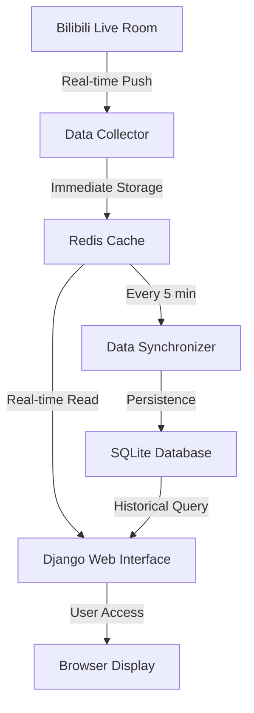

## <a id="english"></a>🇺🇸 English Version

### Project Overview

This is a Django-based Bilibili live streaming data monitoring system that supports real-time collection of danmaku (bullet comments) and gift data, stores them in Redis cache and SQLite database, and provides a web interface for data visualization.

### System Features

- 🚀 **Real-time Data Collection** - Live crawling of danmaku and gift data from Bilibili streams
- 📊 **Data Visualization** - Charts and dashboards showing data trends
- 💾 **Dual Storage** - Redis cache + SQLite database persistence
- 🔄 **Auto Sync** - Scheduled synchronization from Redis to database
- 🌐 **Web Interface** - Intuitive management and viewing interface

### System Architecture



### Project Structure

```
bilibili-live-monitor-django/
├── manage.py                # Command-line utility for Django project
├── requirements.txt         # Project dependencies list
├── bilibili_monitor/        # Main Django application package
│   ├── __init__.py          # Python package identifier
│   ├── settings.py          # Django project configuration
│   ├── urls.py              # Project URL routing configuration
│   ├── wsgi.py              # WSGI server entry point
│   └── asgi.py              # ASGI server entry point
├── live_data/               # Live data processing application
│   ├── __init__.py          # Python package identifier
│   ├── admin.py             # Django admin backend registration
│   ├── apps.py              # Application configuration
│   ├── models.py            # Data model definitions
│   ├── views.py             # View functions for request/response handling
│   ├── urls.py              # Application URL routing configuration
│   ├── tasks.py             # Background task processing
│   ├── management/          # Custom management commands
│   │   └── commands/
│   │       ├── sync_redis_to_db.py     # Redis data sync command
│   │       ├── start_sync_scheduler.py # Data sync scheduler
│   │       └── check_redis_keys.py     # Redis data check command
│   ├── migrations/          # Database migration files directory
│   │   └── __init__.py      # Python package identifier
│   └── templates/           # HTML template files
│       └── live_data/
│           ├── dashboard.html        # Dashboard template
│           ├── danmaku_browser.html  # Danmaku browser template
│           ├── room_list.html        # Room list template
│           └── debug.html            # Debug page template
├── static/                  # Static files (CSS, JS)
│   ├── css/
│   │   └── style.css        # Project stylesheet
│   └── js/
│       └── charts.js        # Chart visualization JavaScript code
├── templates/               # Base template files
│   └── base.html            # Base template for inheritance
├── utils/                   # Utility function modules
│   ├── __init__.py          # Python package identifier
│   ├── bilibili_client.py   # Bilibili API interaction functions
│   ├── redis_handler.py     # Redis data handling functions
│   └── data_processor.py    # Data processing functions
└── README.md                # Project documentation
```

### Setup Instructions

#### 1. Requirements

- **Python 3.7+**
- **Redis server**
- **Internet connection** (to access Bilibili API)

#### 2. Clone the Repository

```bash
git clone <repository-url>
cd bilibili-live-monitor-django
```

#### 3. Install Dependencies

```bash
pip install -r requirements.txt
```

#### 4. Start Redis Service

```bash
# Windows (if using Redis installer)
redis-server

# Or using Docker
docker run -d -p 6379:6379 redis:latest

# Check Redis connection
redis-cli ping
# Should return PONG
```

#### 5. Run Database Migrations

```bash
python manage.py migrate
```

#### 6. Start Development Server

```bash
python manage.py runserver
```

#### 7. Access the Application

Open your browser and navigate to `http://127.0.0.1:8000/live/`

### Usage Tutorial

#### 🚀 Quick Start

1. **Configure Monitoring Rooms**
   
   Edit the `../web_version/multi_room_collector.py` file, find lines 787-793:
   ```python
   # Method 2: Multiple room list
   room_ids = [
       1962481108,  # Room 1 you want to monitor
       22889484,    # Room 2 you want to monitor
       7758258,     # Room 3 you want to monitor
       # You can continue adding more rooms...
   ]
   ```

2. **Start the Complete System**
   
   Go back to the parent directory and run the one-click startup script:
   ```bash
   cd ..
   python setup.py
   ```

3. **View Real-time Data**
   
   Open your browser and visit: `http://localhost:8000/live/`

#### 📊 Main Feature Pages

| Page | URL | Description |
|------|-----|-------------|
| **Main Dashboard** | `/live/` | System overview and real-time statistics |
| **Danmaku Browser** | `/live/danmaku/` | Real-time viewing and searching of danmaku data |
| **Gift Statistics** | `/live/gifts/` | View gift data and statistics |
| **Room Management** | `/live/rooms/` | Manage monitored live rooms |
| **Debug Page** | `/live/debug/` | System status check and debug information |

#### ⚙️ Management Commands

```bash
# Check Redis data
python manage.py check_redis_keys --pattern "room:*" --limit 10

# Manually sync data to database
python manage.py sync_redis_to_db --data-type all

# Start data sync scheduler
python manage.py start_sync_scheduler --interval 300

# Clean up expired data (optional)
python manage.py cleanup_old_data --days 7
```

#### 🔄 Data Sync Workflow

1. **Real-time Collection**: Data collector fetches live data from Bilibili API
2. **Cache Storage**: Data is immediately stored in Redis cache
3. **Scheduled Sync**: Redis data is synced to SQLite database every 5 minutes
4. **Web Display**: View real-time and historical data through Django interface

#### 🎯 Room Selection Recommendations

**Recommended Configuration (Moderate popularity, reasonable data volume):**
```python
room_ids = [
    1962481108,  # Test room
    22889484,    # Medium popularity room
    7758258,     # Active but not overloaded room
]
```

**Avoid Configuration (Excessive data volume):**
```python
# Not recommended - These rooms have massive data volume
room_ids = [
    6,        # Official live room - 1000+ danmaku per minute
    17961,    # Extremely popular room - Massive data volume
    1,        # Official room - High load
]
```

#### 🔧 Performance Optimization Tips

- **Choose Rooms Wisely**: Avoid monitoring extremely popular rooms
- **Adjust Sync Frequency**: Modify sync intervals based on data volume
- **Regular Data Cleanup**: Delete expired danmaku and gift data
- **Monitor Resource Usage**: Keep an eye on memory and disk space usage

### Troubleshooting

#### Common Issues

1. **Redis Connection Failed**
   ```bash
   # Check Redis service status
   redis-cli ping
   
   # If failed, start Redis service
   redis-server
   ```

2. **Django Startup Failed**
   ```bash
   # Check database migrations
   python manage.py migrate
   
   # Check port usage
   netstat -an | findstr 8000
   ```

3. **Data Collection Errors**
   - Verify room IDs are correct
   - Check network connection
   - Review collector logs

4. **Encoding Errors**
   ```bash
   # Set UTF-8 encoding for Windows systems
   set PYTHONIOENCODING=utf-8
   python setup.py
   ```

### Contributing

Feel free to submit issues and pull requests to improve functionality and fix bugs.

---

## License

This project is open source. Please refer to the LICENSE file for details.

## Contact

For questions or support, please create an issue in the repository.