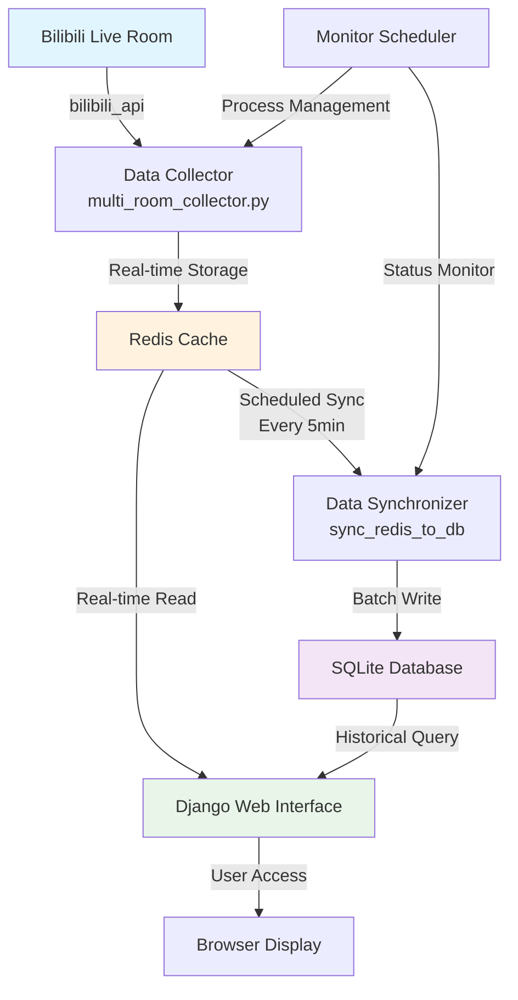
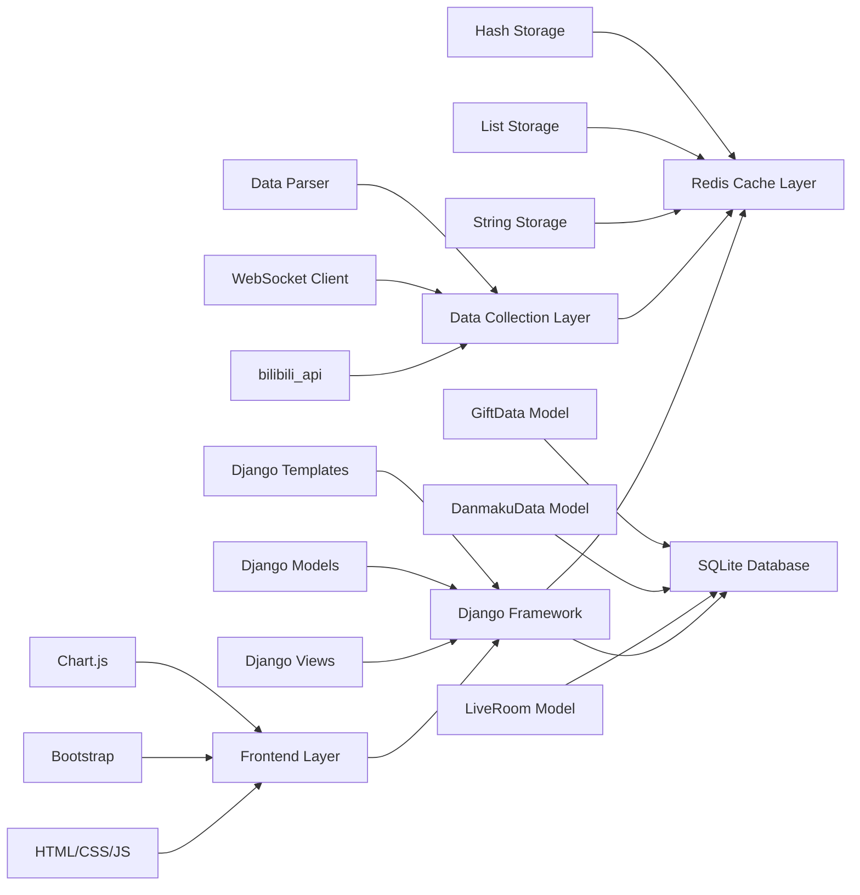
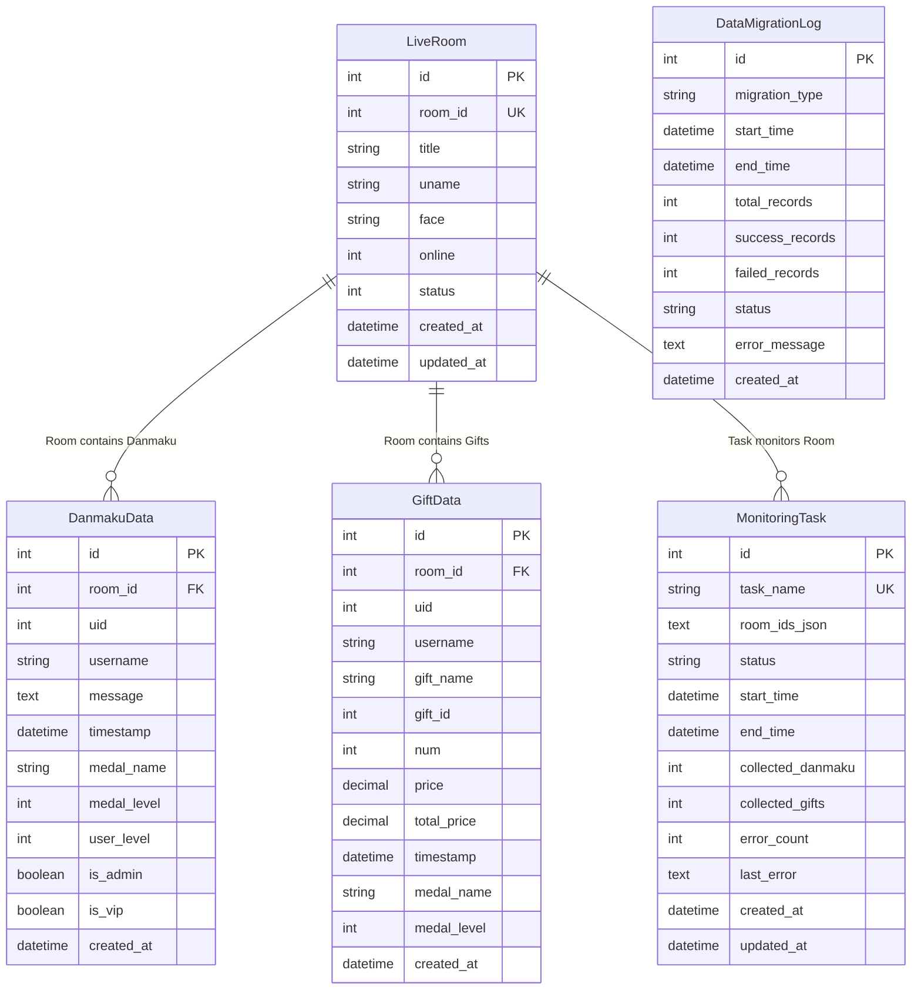

## <a id="english"></a>🇺🇸 English Version

### Project Overview

This is a Django-based Bilibili live streaming data monitoring system that supports real-time collection of danmaku (bullet comments) and gift data, stores them in Redis cache and SQLite database, and provides a web interface for data visualization.

### System Features

- 🚀 **Real-time Data Collection** - Live crawling of danmaku and gift data from Bilibili streams
- 📊 **Data Visualization** - Charts and dashboards showing data trends
- 💾 **Dual Storage** - Redis cache + SQLite database persistence
- 🔄 **Auto Sync** - Scheduled synchronization from Redis to database
- 🌐 **Web Interface** - Intuitive management and viewing interface

## 🏗️ System Architecture & Implementation Flow

### Core Process Flow



### Detailed Implementation Flow

#### 1. Data Collection Phase
```
Bilibili API ➜ bilibili_api Library ➜ WebSocket Connection ➜ Real-time Data Stream
   ↓
Parse Data Packets ➜ Extract Danmaku/Gift Info ➜ Format Data Structure
   ↓
Redis Storage ➜ Store by Room Category ➜ Set Data Expiration
```

#### 2. Real-time Display Phase
```
Django Views ➜ Redis Query ➜ Data Formatting ➜ Template Rendering
   ↓
JavaScript Polling ➜ AJAX Requests ➜ Dynamic Page Updates
   ↓
Chart Library Rendering ➜ Real-time Statistics Charts ➜ User Interface Display
```

#### 3. Data Persistence Phase
```
Scheduled Tasks ➜ Redis Data Reading ➜ Batch Data Processing
   ↓
Data Validation ➜ Deduplication ➜ Database Transaction Write
   ↓
Redis Cleanup ➜ Log Recording ➜ Status Update
```

### Technology Stack Architecture



## 📊 Database Logic Structure

### Redis Data Structure

```
Redis Keys Organization:
├── room:{room_id}:info          # Room Basic Info (Hash)
│   ├── title: "Live Room Title"
│   ├── uname: "Streamer Name"
│   ├── online: "Online Count"
│   └── status: "Live Status"
│
├── room:{room_id}:danmaku       # Danmaku Data (List)
│   ├── [0] {"uid": 123, "username": "User1", "message": "Danmaku Content", "timestamp": 1699123456}
│   ├── [1] {"uid": 456, "username": "User2", "message": "Danmaku Content", "timestamp": 1699123457}
│   └── ...
│
├── room:{room_id}:gifts         # Gift Data (List)
│   ├── [0] {"uid": 789, "gift_name": "Heart", "num": 1, "price": 0.1, "timestamp": 1699123458}
│   ├── [1] {"uid": 101, "gift_name": "Balloon", "num": 5, "price": 50.0, "timestamp": 1699123459}
│   └── ...
│
└── room:{room_id}:stats         # Statistics Info (Hash)
    ├── total_danmaku: "1234"
    ├── total_gifts: "56"
    ├── total_users: "789"
    └── last_update: "1699123460"
```

### SQLite Database Structure

```sql
-- Live Room Basic Info Table
CREATE TABLE live_data_liveroom (
    id INTEGER PRIMARY KEY AUTOINCREMENT,
    room_id INTEGER UNIQUE NOT NULL,           -- Room ID
    title VARCHAR(200) NOT NULL,               -- Live Room Title
    uname VARCHAR(100) NOT NULL,               -- Streamer Username
    face VARCHAR(500),                         -- Streamer Avatar URL
    online INTEGER DEFAULT 0,                 -- Online Count
    status INTEGER DEFAULT 0,                 -- Live Status (0:Offline, 1:Live, 2:Replay)
    created_at DATETIME DEFAULT CURRENT_TIMESTAMP,
    updated_at DATETIME DEFAULT CURRENT_TIMESTAMP
);

-- Danmaku Data Table
CREATE TABLE live_data_danmakudata (
    id INTEGER PRIMARY KEY AUTOINCREMENT,
    room_id INTEGER NOT NULL,                 -- Associated Room ID
    uid INTEGER NOT NULL,                     -- User UID
    username VARCHAR(50) NOT NULL,            -- Username
    message TEXT NOT NULL,                    -- Danmaku Content
    timestamp DATETIME NOT NULL,              -- Send Time
    medal_name VARCHAR(50),                   -- Fan Badge Name
    medal_level INTEGER DEFAULT 0,           -- Fan Badge Level
    user_level INTEGER DEFAULT 0,            -- User Level
    is_admin BOOLEAN DEFAULT FALSE,           -- Is Administrator
    is_vip BOOLEAN DEFAULT FALSE,             -- Is VIP
    created_at DATETIME DEFAULT CURRENT_TIMESTAMP,
    FOREIGN KEY (room_id) REFERENCES live_data_liveroom (room_id)
);

-- Gift Data Table
CREATE TABLE live_data_giftdata (
    id INTEGER PRIMARY KEY AUTOINCREMENT,
    room_id INTEGER NOT NULL,                 -- Associated Room ID
    uid INTEGER NOT NULL,                     -- User UID
    username VARCHAR(50) NOT NULL,            -- Username
    gift_name VARCHAR(100) NOT NULL,          -- Gift Name
    gift_id INTEGER NOT NULL,                 -- Gift ID
    num INTEGER DEFAULT 1,                   -- Gift Quantity
    price DECIMAL(10,2) DEFAULT 0.00,        -- Unit Price
    total_price DECIMAL(10,2) DEFAULT 0.00,  -- Total Price
    timestamp DATETIME NOT NULL,              -- Gift Time
    medal_name VARCHAR(50),                   -- Fan Badge Name
    medal_level INTEGER DEFAULT 0,           -- Fan Badge Level
    created_at DATETIME DEFAULT CURRENT_TIMESTAMP,
    FOREIGN KEY (room_id) REFERENCES live_data_liveroom (room_id)
);

-- Monitoring Task Table
CREATE TABLE live_data_monitoringtask (
    id INTEGER PRIMARY KEY AUTOINCREMENT,
    task_name VARCHAR(100) UNIQUE NOT NULL,   -- Task Name
    room_ids_json TEXT,                       -- Monitored Room ID List (JSON format)
    status VARCHAR(20) DEFAULT 'stopped',     -- Task Status
    start_time DATETIME,                      -- Start Time
    end_time DATETIME,                        -- End Time
    collected_danmaku INTEGER DEFAULT 0,     -- Collected Danmaku Count
    collected_gifts INTEGER DEFAULT 0,       -- Collected Gift Count
    error_count INTEGER DEFAULT 0,           -- Error Count
    last_error TEXT,                         -- Last Error Message
    created_at DATETIME DEFAULT CURRENT_TIMESTAMP,
    updated_at DATETIME DEFAULT CURRENT_TIMESTAMP
);

-- Data Sync Log Table
CREATE TABLE live_data_datamigrationlog (
    id INTEGER PRIMARY KEY AUTOINCREMENT,
    migration_type VARCHAR(50) NOT NULL,      -- Sync Type
    start_time DATETIME NOT NULL,             -- Start Time
    end_time DATETIME,                        -- End Time
    total_records INTEGER DEFAULT 0,         -- Total Records
    success_records INTEGER DEFAULT 0,       -- Success Records
    failed_records INTEGER DEFAULT 0,        -- Failed Records
    status VARCHAR(20) DEFAULT 'running',    -- Sync Status
    error_message TEXT,                       -- Error Message
    created_at DATETIME DEFAULT CURRENT_TIMESTAMP
);

-- Index Optimization
CREATE INDEX idx_danmaku_room_timestamp ON live_data_danmakudata(room_id, timestamp);
CREATE INDEX idx_danmaku_uid ON live_data_danmakudata(uid);
CREATE INDEX idx_gift_room_timestamp ON live_data_giftdata(room_id, timestamp);
CREATE INDEX idx_gift_uid ON live_data_giftdata(uid);
CREATE INDEX idx_migration_status ON live_data_datamigrationlog(status, start_time);
```

### Data Relationship Diagram



## 🔄 Detailed Data Flow Description

### 1. Real-time Data Collection Process

```python
# Data collection pseudo-code
async def collect_room_data(room_id):
    """Real-time collection of specified room data"""
    
    # 1. Establish WebSocket connection
    room = live.LiveRoom(room_display_id=room_id)
    
    # 2. Register event handlers
    @room.on('DANMU_MSG')
    async def on_danmaku(event):
        danmaku_data = {
            'room_id': room_id,
            'uid': event['data']['info'][2][0],
            'username': event['data']['info'][2][1],
            'message': event['data']['info'][1],
            'timestamp': time.time()
        }
        # Store to Redis
        redis_client.lpush(f'room:{room_id}:danmaku', 
                          json.dumps(danmaku_data))
    
    @room.on('SEND_GIFT')
    async def on_gift(event):
        gift_data = {
            'room_id': room_id,
            'uid': event['data']['uid'],
            'username': event['data']['uname'],
            'gift_name': event['data']['giftName'],
            'num': event['data']['num'],
            'price': event['data']['price'],
            'timestamp': time.time()
        }
        # Store to Redis
        redis_client.lpush(f'room:{room_id}:gifts', 
                          json.dumps(gift_data))
    
    # 3. Start listening
    await room.connect()
```

### 2. Data Synchronization Mechanism

```python
# Data sync pseudo-code
class DataSynchronizer:
    """Data Synchronizer"""
    
    def sync_danmaku_data(self, room_id):
        """Sync danmaku data"""
        # 1. Get data from Redis
        danmaku_list = redis_client.lrange(
            f'room:{room_id}:danmaku', 0, 1000
        )
        
        # 2. Batch process data
        batch_data = []
        for danmaku_json in danmaku_list:
            danmaku_data = json.loads(danmaku_json)
            batch_data.append(
                DanmakuData(**danmaku_data)
            )
        
        # 3. Batch write to database
        with transaction.atomic():
            DanmakuData.objects.bulk_create(
                batch_data, ignore_conflicts=True
            )
        
        # 4. Clean Redis data
        redis_client.ltrim(f'room:{room_id}:danmaku', 1000, -1)
    
    def schedule_sync(self, interval=300):
        """Scheduled sync task"""
        while True:
            try:
                # Get all monitored rooms
                room_ids = self.get_monitored_rooms()
                
                # Sync one by one
                for room_id in room_ids:
                    self.sync_danmaku_data(room_id)
                    self.sync_gift_data(room_id)
                
                # Log sync status
                self.log_sync_status('success')
                
            except Exception as e:
                self.log_sync_status('failed', str(e))
            
            time.sleep(interval)
```

### 3. Web Interface Data Display

```python
# Django view pseudo-code
class DashboardView(View):
    """Dashboard View"""
    
    def get(self, request):
        # 1. Get real-time statistics
        stats = self.get_realtime_stats()
        
        # 2. Get active rooms
        active_rooms = self.get_active_rooms()
        
        # 3. Get trend data
        trend_data = self.get_trend_data()
        
        context = {
            'stats': stats,
            'active_rooms': active_rooms,
            'trend_data': trend_data
        }
        return render(request, 'dashboard.html', context)
    
    def get_realtime_stats(self):
        """Get real-time statistics data"""
        stats = {}
        
        # Redis real-time data
        for room_id in self.get_monitored_rooms():
            danmaku_count = redis_client.llen(
                f'room:{room_id}:danmaku'
            )
            gift_count = redis_client.llen(
                f'room:{room_id}:gifts'
            )
            stats[room_id] = {
                'danmaku_count': danmaku_count,
                'gift_count': gift_count
            }
        
        return stats
```

### Project Structure

```
bilibili-live-monitor-django/
├── manage.py                # Command-line utility for Django project
├── requirements.txt         # Project dependencies list
├── bilibili_monitor/        # Main Django application package
│   ├── __init__.py          # Python package identifier
│   ├── settings.py          # Django project configuration
│   ├── urls.py              # Project URL routing configuration
│   ├── wsgi.py              # WSGI server entry point
│   └── asgi.py              # ASGI server entry point
├── live_data/               # Live data processing application
│   ├── __init__.py          # Python package identifier
│   ├── admin.py             # Django admin backend registration
│   ├── apps.py              # Application configuration
│   ├── models.py            # Data model definitions
│   ├── views.py             # View functions for request/response handling
│   ├── urls.py              # Application URL routing configuration
│   ├── tasks.py             # Background task processing
│   ├── management/          # Custom management commands
│   │   └── commands/
│   │       ├── sync_redis_to_db.py     # Redis data sync command
│   │       ├── start_sync_scheduler.py # Data sync scheduler
│   │       └── check_redis_keys.py     # Redis data check command
│   ├── migrations/          # Database migration files directory
│   │   └── __init__.py      # Python package identifier
│   └── templates/           # HTML template files
│       └── live_data/
│           ├── dashboard.html        # Dashboard template
│           ├── danmaku_browser.html  # Danmaku browser template
│           ├── room_list.html        # Room list template
│           └── debug.html            # Debug page template
├── static/                  # Static files (CSS, JS)
│   ├── css/
│   │   └── style.css        # Project stylesheet
│   └── js/
│       └── charts.js        # Chart visualization JavaScript code
├── templates/               # Base template files
│   └── base.html            # Base template for inheritance
├── utils/                   # Utility function modules
│   ├── __init__.py          # Python package identifier
│   ├── bilibili_client.py   # Bilibili API interaction functions
│   ├── redis_handler.py     # Redis data handling functions
│   └── data_processor.py    # Data processing functions
└── README.md                # Project documentation
```

### Setup Instructions

#### 1. Requirements

- **Python 3.7+**
- **Redis server**
- **Internet connection** (to access Bilibili API)

#### 2. Clone the Repository

```bash
git clone <repository-url>
cd bilibili-live-monitor-django
```

#### 3. Install Dependencies

```bash
pip install -r requirements.txt
```

#### 4. Start Redis Service

```bash
# Windows (if using Redis installer)
redis-server

# Or using Docker
docker run -d -p 6379:6379 redis:latest

# Check Redis connection
redis-cli ping
# Should return PONG
```

#### 5. Run Database Migrations

```bash
python manage.py migrate
```

#### 6. Start Development Server

```bash
python manage.py runserver
```

#### 7. Access the Application

Open your browser and navigate to `http://127.0.0.1:8000/live/`

### Usage Tutorial

#### 🚀 Quick Start

1. **Configure Monitoring Rooms**
   
   Edit the `../web_version/multi_room_collector.py` file, find lines 787-793:
   ```python
   # Method 2: Multiple room list
   room_ids = [
       1962481108,  # Room 1 you want to monitor
       22889484,    # Room 2 you want to monitor
       7758258,     # Room 3 you want to monitor
       # You can continue adding more rooms...
   ]
   ```

2. **Start the Complete System**
   
   Go back to the parent directory and run the one-click startup script:
   ```bash
   cd ..
   python setup.py
   ```

3. **View Real-time Data**
   
   Open your browser and visit: `http://localhost:8000/live/`

#### 📊 Main Feature Pages

| Page | URL | Description |
|------|-----|-------------|
| **Main Dashboard** | `/live/` | System overview and real-time statistics |
| **Danmaku Browser** | `/live/danmaku/` | Real-time viewing and searching of danmaku data |
| **Gift Statistics** | `/live/gifts/` | View gift data and statistics |
| **Room Management** | `/live/rooms/` | Manage monitored live rooms |
| **Debug Page** | `/live/debug/` | System status check and debug information |

#### ⚙️ Management Commands

```bash
# Check Redis data
python manage.py check_redis_keys --pattern "room:*" --limit 10

# Manually sync data to database
python manage.py sync_redis_to_db --data-type all

# Start data sync scheduler
python manage.py start_sync_scheduler --interval 300

# Clean up expired data (optional)
python manage.py cleanup_old_data --days 7
```

#### 🔄 Data Sync Workflow

1. **Real-time Collection**: Data collector fetches live data from Bilibili API
2. **Cache Storage**: Data is immediately stored in Redis cache
3. **Scheduled Sync**: Redis data is synced to SQLite database every 5 minutes
4. **Web Display**: View real-time and historical data through Django interface

#### 🎯 Room Selection Recommendations

**Recommended Configuration (Moderate popularity, reasonable data volume):**
```python
room_ids = [
    1962481108,  # Test room
    22889484,    # Medium popularity room
    7758258,     # Active but not overloaded room
]
```

**Avoid Configuration (Excessive data volume):**
```python
# Not recommended - These rooms have massive data volume
room_ids = [
    6,        # Official live room - 1000+ danmaku per minute
    17961,    # Extremely popular room - Massive data volume
    1,        # Official room - High load
]
```

#### 🔧 Performance Optimization Tips

- **Choose Rooms Wisely**: Avoid monitoring extremely popular rooms
- **Adjust Sync Frequency**: Modify sync intervals based on data volume
- **Regular Data Cleanup**: Delete expired danmaku and gift data
- **Monitor Resource Usage**: Keep an eye on memory and disk space usage

### Troubleshooting

#### Common Issues

1. **Redis Connection Failed**
   ```bash
   # Check Redis service status
   redis-cli ping
   
   # If failed, start Redis service
   redis-server
   ```

2. **Django Startup Failed**
   ```bash
   # Check database migrations
   python manage.py migrate
   
   # Check port usage
   netstat -an | findstr 8000
   ```

3. **Data Collection Errors**
   - Verify room IDs are correct
   - Check network connection
   - Review collector logs

4. **Encoding Errors**
   ```bash
   # Set UTF-8 encoding for Windows systems
   set PYTHONIOENCODING=utf-8
   python setup.py
   ```

### Contributing

Feel free to submit issues and pull requests to improve functionality and fix bugs.

---

## License

This project is open source. Please refer to the LICENSE file for details.

## Contact

For questions or support, please create an issue in the repository.