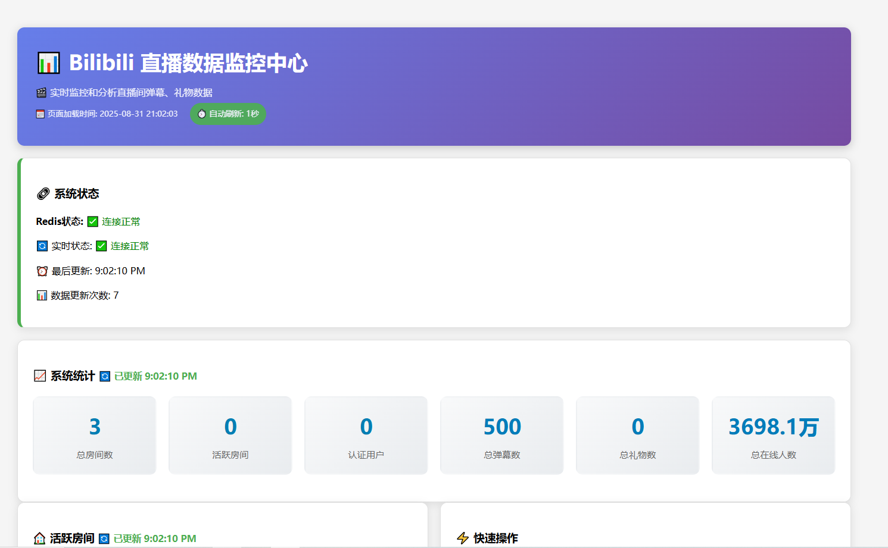
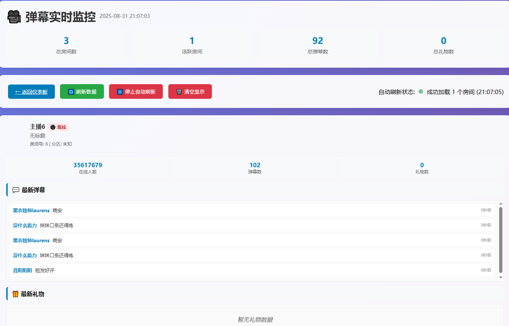
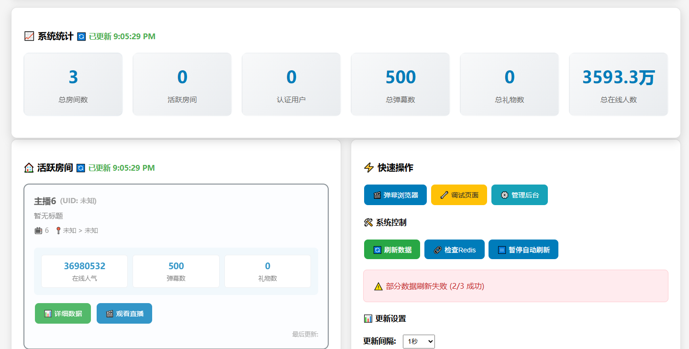
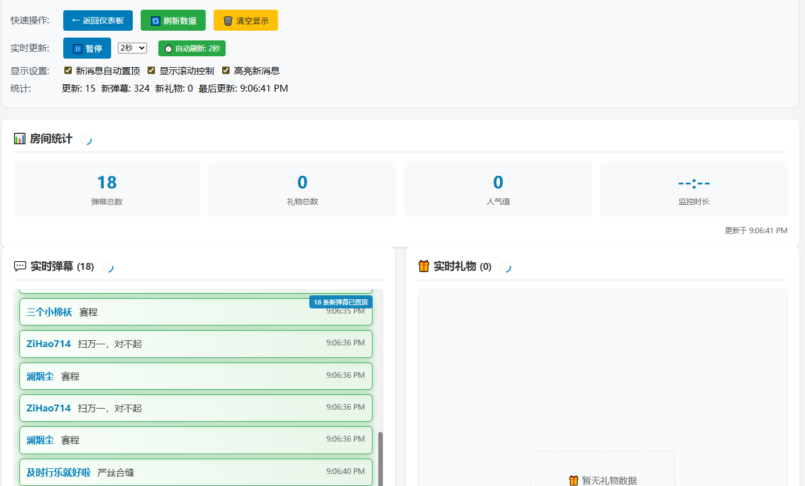

# Bilibili Live Monitor System

A Django and Redis-based real-time Bilibili live streaming data monitoring system that supports multi-room monitoring, real-time danmaku collection, gift statistics, and data visualization.

## 🌟 Features

- 🎯 **Multi-room Monitoring** - Monitor multiple live rooms simultaneously
- 💬 **Real-time Danmaku Collection** - Real-time collection and display of bullet comments
- 🎁 **Gift Statistics Analysis** - Statistics on gift quantity, value, and trends
- 📊 **Data Visualization** - Django web interface for real-time data display
- 💾 **High-performance Storage** - Redis cache ensures fast data access
- ⚡ **Real-time Updates** - Auto-refresh and WebSocket real-time push
- 🔄 **Auto-restart** - Automatic recovery when services fail
- 🛠️ **Debug Tools** - Complete debugging and monitoring tools

## 📸 Live Demo Screenshots

### 🏠 Main Dashboard
> System overview interface showing real-time statistics and status of all monitored rooms



### 💬 Danmaku Browser
> Real-time danmaku viewing and search interface with multi-room switching and live updates



### 📊 Data Statistics Charts
> Real-time data visualization charts showing danmaku and gift data trends



### 🏠 Room Detail Page
> Detailed information and real-time data display for individual rooms



### 🔧 System Debug Page
> System status monitoring and debug information interface


## 🏗️ System Architecture & Implementation Flow

### Core Process Flow


### Detailed Implementation Flow

#### 1. Data Collection Phase
```
Bilibili API ➜ bilibili_api Library ➜ WebSocket Connection ➜ Real-time Data Stream
   ↓
Parse Data Packets ➜ Extract Danmaku/Gift Info ➜ Format Data Structure
   ↓
Redis Storage ➜ Store by Room Category ➜ Set Data Expiration
```

#### 2. Real-time Display Phase
```
Django Views ➜ Redis Query ➜ Data Formatting ➜ Template Rendering
   ↓
JavaScript Polling ➜ AJAX Requests ➜ Dynamic Page Updates
   ↓
Chart Library Rendering ➜ Real-time Statistics Charts ➜ User Interface Display
```

#### 3. Data Persistence Phase
```
Scheduled Tasks ➜ Redis Data Reading ➜ Batch Data Processing
   ↓
Data Validation ➜ Deduplication ➜ Database Transaction Write
   ↓
Redis Cleanup ➜ Log Recording ➜ Status Update
```

### Technology Stack Architecture


## 📊 Database Logic Structure

### Redis Data Structure

```
Redis Keys Organization:
├── room:{room_id}:info          # Room Basic Info (Hash)
│   ├── title: "Live Room Title"
│   ├── uname: "Streamer Name"
│   ├── online: "Online Count"
│   └── status: "Live Status"
│
├── room:{room_id}:danmaku       # Danmaku Data (List)
│   ├── [0] {"uid": 123, "username": "User1", "message": "Danmaku Content", "timestamp": 1699123456}
│   ├── [1] {"uid": 456, "username": "User2", "message": "Danmaku Content", "timestamp": 1699123457}
│   └── ...
│
├── room:{room_id}:gifts         # Gift Data (List)
│   ├── [0] {"uid": 789, "gift_name": "Heart", "num": 1, "price": 0.1, "timestamp": 1699123458}
│   ├── [1] {"uid": 101, "gift_name": "Balloon", "num": 5, "price": 50.0, "timestamp": 1699123459}
│   └── ...
│
└── room:{room_id}:stats         # Statistics Info (Hash)
    ├── total_danmaku: "1234"
    ├── total_gifts: "56"
    ├── total_users: "789"
    └── last_update: "1699123460"
```

### SQLite Database Structure

```sql
-- Live Room Basic Info Table
CREATE TABLE live_data_liveroom (
    id INTEGER PRIMARY KEY AUTOINCREMENT,
    room_id INTEGER UNIQUE NOT NULL,           -- Room ID
    title VARCHAR(200) NOT NULL,               -- Live Room Title
    uname VARCHAR(100) NOT NULL,               -- Streamer Username
    face VARCHAR(500),                         -- Streamer Avatar URL
    online INTEGER DEFAULT 0,                 -- Online Count
    status INTEGER DEFAULT 0,                 -- Live Status (0:Offline, 1:Live, 2:Replay)
    created_at DATETIME DEFAULT CURRENT_TIMESTAMP,
    updated_at DATETIME DEFAULT CURRENT_TIMESTAMP
);

-- Danmaku Data Table
CREATE TABLE live_data_danmakudata (
    id INTEGER PRIMARY KEY AUTOINCREMENT,
    room_id INTEGER NOT NULL,                 -- Associated Room ID
    uid INTEGER NOT NULL,                     -- User UID
    username VARCHAR(50) NOT NULL,            -- Username
    message TEXT NOT NULL,                    -- Danmaku Content
    timestamp DATETIME NOT NULL,              -- Send Time
    medal_name VARCHAR(50),                   -- Fan Badge Name
    medal_level INTEGER DEFAULT 0,           -- Fan Badge Level
    user_level INTEGER DEFAULT 0,            -- User Level
    is_admin BOOLEAN DEFAULT FALSE,           -- Is Administrator
    is_vip BOOLEAN DEFAULT FALSE,             -- Is VIP
    created_at DATETIME DEFAULT CURRENT_TIMESTAMP,
    FOREIGN KEY (room_id) REFERENCES live_data_liveroom (room_id)
);

-- Gift Data Table
CREATE TABLE live_data_giftdata (
    id INTEGER PRIMARY KEY AUTOINCREMENT,
    room_id INTEGER NOT NULL,                 -- Associated Room ID
    uid INTEGER NOT NULL,                     -- User UID
    username VARCHAR(50) NOT NULL,            -- Username
    gift_name VARCHAR(100) NOT NULL,          -- Gift Name
    gift_id INTEGER NOT NULL,                 -- Gift ID
    num INTEGER DEFAULT 1,                   -- Gift Quantity
    price DECIMAL(10,2) DEFAULT 0.00,        -- Unit Price
    total_price DECIMAL(10,2) DEFAULT 0.00,  -- Total Price
    timestamp DATETIME NOT NULL,              -- Gift Time
    medal_name VARCHAR(50),                   -- Fan Badge Name
    medal_level INTEGER DEFAULT 0,           -- Fan Badge Level
    created_at DATETIME DEFAULT CURRENT_TIMESTAMP,
    FOREIGN KEY (room_id) REFERENCES live_data_liveroom (room_id)
);

-- Monitoring Task Table
CREATE TABLE live_data_monitoringtask (
    id INTEGER PRIMARY KEY AUTOINCREMENT,
    task_name VARCHAR(100) UNIQUE NOT NULL,   -- Task Name
    room_ids_json TEXT,                       -- Monitored Room ID List (JSON format)
    status VARCHAR(20) DEFAULT 'stopped',     -- Task Status
    start_time DATETIME,                      -- Start Time
    end_time DATETIME,                        -- End Time
    collected_danmaku INTEGER DEFAULT 0,     -- Collected Danmaku Count
    collected_gifts INTEGER DEFAULT 0,       -- Collected Gift Count
    error_count INTEGER DEFAULT 0,           -- Error Count
    last_error TEXT,                         -- Last Error Message
    created_at DATETIME DEFAULT CURRENT_TIMESTAMP,
    updated_at DATETIME DEFAULT CURRENT_TIMESTAMP
);

-- Data Sync Log Table
CREATE TABLE live_data_datamigrationlog (
    id INTEGER PRIMARY KEY AUTOINCREMENT,
    migration_type VARCHAR(50) NOT NULL,      -- Sync Type
    start_time DATETIME NOT NULL,             -- Start Time
    end_time DATETIME,                        -- End Time
    total_records INTEGER DEFAULT 0,         -- Total Records
    success_records INTEGER DEFAULT 0,       -- Success Records
    failed_records INTEGER DEFAULT 0,        -- Failed Records
    status VARCHAR(20) DEFAULT 'running',    -- Sync Status
    error_message TEXT,                       -- Error Message
    created_at DATETIME DEFAULT CURRENT_TIMESTAMP
);

-- Index Optimization
CREATE INDEX idx_danmaku_room_timestamp ON live_data_danmakudata(room_id, timestamp);
CREATE INDEX idx_danmaku_uid ON live_data_danmakudata(uid);
CREATE INDEX idx_gift_room_timestamp ON live_data_giftdata(room_id, timestamp);
CREATE INDEX idx_gift_uid ON live_data_giftdata(uid);
CREATE INDEX idx_migration_status ON live_data_datamigrationlog(status, start_time);
```

### Data Relationship Diagram


## 🔄 Detailed Data Flow Description

### 1. Real-time Data Collection Process

```python
# Data collection pseudo-code
async def collect_room_data(room_id):
    """Real-time collection of specified room data"""
    
    # 1. Establish WebSocket connection
    room = live.LiveRoom(room_display_id=room_id)
    
    # 2. Register event handlers
    @room.on('DANMU_MSG')
    async def on_danmaku(event):
        danmaku_data = {
            'room_id': room_id,
            'uid': event['data']['info'][2][0],
            'username': event['data']['info'][2][1],
            'message': event['data']['info'][1],
            'timestamp': time.time()
        }
        # Store to Redis
        redis_client.lpush(f'room:{room_id}:danmaku', 
                          json.dumps(danmaku_data))
    
    @room.on('SEND_GIFT')
    async def on_gift(event):
        gift_data = {
            'room_id': room_id,
            'uid': event['data']['uid'],
            'username': event['data']['uname'],
            'gift_name': event['data']['giftName'],
            'num': event['data']['num'],
            'price': event['data']['price'],
            'timestamp': time.time()
        }
        # Store to Redis
        redis_client.lpush(f'room:{room_id}:gifts', 
                          json.dumps(gift_data))
    
    # 3. Start listening
    await room.connect()
```

### 2. Data Synchronization Mechanism

```python
# Data sync pseudo-code
class DataSynchronizer:
    """Data Synchronizer"""
    
    def sync_danmaku_data(self, room_id):
        """Sync danmaku data"""
        # 1. Get data from Redis
        danmaku_list = redis_client.lrange(
            f'room:{room_id}:danmaku', 0, 1000
        )
        
        # 2. Batch process data
        batch_data = []
        for danmaku_json in danmaku_list:
            danmaku_data = json.loads(danmaku_json)
            batch_data.append(
                DanmakuData(**danmaku_data)
            )
        
        # 3. Batch write to database
        with transaction.atomic():
            DanmakuData.objects.bulk_create(
                batch_data, ignore_conflicts=True
            )
        
        # 4. Clean Redis data
        redis_client.ltrim(f'room:{room_id}:danmaku', 1000, -1)
    
    def schedule_sync(self, interval=300):
        """Scheduled sync task"""
        while True:
            try:
                # Get all monitored rooms
                room_ids = self.get_monitored_rooms()
                
                # Sync one by one
                for room_id in room_ids:
                    self.sync_danmaku_data(room_id)
                    self.sync_gift_data(room_id)
                
                # Log sync status
                self.log_sync_status('success')
                
            except Exception as e:
                self.log_sync_status('failed', str(e))
            
            time.sleep(interval)
```

### 3. Web Interface Data Display

```python
# Django view pseudo-code
class DashboardView(View):
    """Dashboard View"""
    
    def get(self, request):
        # 1. Get real-time statistics
        stats = self.get_realtime_stats()
        
        # 2. Get active rooms
        active_rooms = self.get_active_rooms()
        
        # 3. Get trend data
        trend_data = self.get_trend_data()
        
        context = {
            'stats': stats,
            'active_rooms': active_rooms,
            'trend_data': trend_data
        }
        return render(request, 'dashboard.html', context)
    
    def get_realtime_stats(self):
        """Get real-time statistics data"""
        stats = {}
        
        # Redis real-time data
        for room_id in self.get_monitored_rooms():
            danmaku_count = redis_client.llen(
                f'room:{room_id}:danmaku'
            )
            gift_count = redis_client.llen(
                f'room:{room_id}:gifts'
            )
            stats[room_id] = {
                'danmaku_count': danmaku_count,
                'gift_count': gift_count
            }
        
        return stats
```

## 📋 System Requirements

- **Python**: 3.8 or higher
- **Redis**: 6.0 or higher
- **Operating System**: Windows/Linux/macOS
- **Memory**: 4GB+ recommended
- **Network**: Stable internet connection

## 🚀 Quick Start

### 1. Clone Repository

```bash
git clone https://github.com/YOUR_USERNAME/bilibili-live-monitor.git
cd bilibili-live-monitor
```

### 2. Install Dependencies

```bash
# Install Python dependencies
pip install -r requirements.txt

# Or using conda
conda install --file requirements.txt
```

### 3. Start Redis Service

```bash
# Windows (using chocolatey)
choco install redis-64
redis-server

# Linux (Ubuntu/Debian)
sudo apt-get install redis-server
sudo systemctl start redis

# macOS (using homebrew)
brew install redis
brew services start redis
```

### 4. Configure Django

```bash
cd bilibili-live-monitor-django

# Database migration
python manage.py migrate

# Create superuser (optional)
python manage.py createsuperuser

# Collect static files
python manage.py collectstatic
```

### 5. Start System

#### Method 1: One-click Startup (Recommended)

```bash
# Return to project root directory
cd ..

# One-click start all services
python setup.py
```

Startup effect as shown:


#### Method 2: Start Separately

```bash
# Terminal 1: Start data collector
cd web_version
python multi_room_collector.py

# Terminal 2: Start Django server
cd bilibili-live-monitor-django
python manage.py runserver 0.0.0.0:8000
```

### 6. Access System

Open browser and visit the following addresses:

- 🏠 **Homepage**: http://localhost:8000/live/
- 📊 **Data Dashboard**: http://localhost:8000/live/dashboard/
- 💬 **Danmaku Browser**: http://localhost:8000/live/danmaku/
- 🔧 **Debug Page**: http://localhost:8000/live/debug/

## 📁 Project Structure

```
bilibili-live-monitor/
├── bilibili-live-monitor-django/     # Django Web Application
│   ├── bilibili_monitor/             # Django project configuration
│   ├── live_data/                    # Main application module
│   │   ├── templates/                # HTML templates
│   │   ├── static/                   # Static files
│   │   ├── management/               # Django management commands
│   │   └── ...
│   ├── utils/                        # Utility libraries
│   ├── static/                       # Global static files
│   ├── logs/                         # Log files
│   └── manage.py                     # Django management script
├── web_version/                      # Data collector
│   ├── multi_room_collector.py       # Multi-room collector
│   ├── simple_redis_saver.py         # Redis data saver
│   └── ...
├── docs/                             # Documentation and images
│   └── images/                       # Interface screenshots
├── live_data/                        # Historical data and tools
├── spider_live_data/                 # Data analysis tools
├── setup.py                         # One-click startup script
├── requirements.txt                  # Python dependencies
└── README.md                         # Project documentation
```

## ⚙️ Configuration

### Monitor Room Configuration

Edit the room ID list in `web_version/multi_room_collector.py`:

```python
# Default monitored room IDs
DEFAULT_ROOMS = [
    1962481108,  # Room 1
    1982728080,  # Room 2
    1959064353,  # Room 3
    # Add more room IDs...
]
```

### Redis Configuration

Edit `utils/redis_config.py`:

```python
REDIS_CONFIG = {
    'host': 'localhost',
    'port': 6379,
    'db': 0,
    'decode_responses': True,
    'max_connections': 50
}
```

### Django Configuration

Edit `bilibili_monitor/settings.py`:

```python
# Database configuration
DATABASES = {
    'default': {
        'ENGINE': 'django.db.backends.sqlite3',
        'NAME': BASE_DIR / 'db.sqlite3',
    }
}

# Redis configuration
CACHES = {
    'default': {
        'BACKEND': 'django_redis.cache.RedisCache',
        'LOCATION': 'redis://127.0.0.1:6379/0',
    }
}
```

## 🔧 Advanced Usage

### Custom Monitor Rooms

```bash
# Monitor specific rooms
python setup.py --rooms 1962481108,1982728080,1959064353

# Use configuration file
python setup.py --config custom_config.json
```

### Start Specific Services Only

```bash
# Django only
python setup.py --django-only

# Data collector only
python setup.py --collector-only
```

### Using API

The system provides RESTful API interfaces:

```bash
# Get room danmaku data
curl http://localhost:8000/live/api/room/1962481108/danmaku/

# Get room gift data
curl http://localhost:8000/live/api/room/1962481108/gifts/

# Get room statistics
curl http://localhost:8000/live/api/room/1962481108/stats/
```

### Debug Mode

```bash
# Enable detailed debug information
python setup.py --no-background --status-display

# View Redis data
python manage.py shell
>>> from utils.redis_handler import get_redis_client
>>> client = get_redis_client()
>>> client.keys('room:*')
```

## 🐛 Troubleshooting

### Common Issues

**Q: Collector process stops frequently**
```bash
# Check Redis connection
redis-cli ping

# View error logs
tail -f logs/collector.log

# Use debug mode
python setup.py --no-background
```

**Q: Encoding errors (UnicodeEncodeError)**
```bash
# Set environment variable for Windows
set PYTHONIOENCODING=utf-8

# Or set in code
os.environ['PYTHONIOENCODING'] = 'utf-8'
```

**Q: Django cannot be accessed**
```bash
# Check if port is occupied
netstat -an | grep 8000

# Use different port
python manage.py runserver 0.0.0.0:8080
```

**Q: Redis connection failed**
```bash
# Check Redis service status
redis-cli ping

# Start Redis on Windows
redis-server

# Start Redis on Linux
sudo systemctl start redis
```

### Log Files

- **Django logs**: `logs/django.log`
- **Collector logs**: `logs/collector.log`
- **Startup logs**: `startup.log`

## 🤝 Contributing

Welcome to submit issues and pull requests!

1. Fork the project
2. Create feature branch (`git checkout -b feature/AmazingFeature`)
3. Commit changes (`git commit -m 'Add some AmazingFeature'`)
4. Push to branch (`git push origin feature/AmazingFeature`)
5. Open Pull Request

## 📄 License

This project is open source under the MIT License - see [LICENSE](LICENSE) file for details

---

⭐ If this project helps you, please give it a Star!