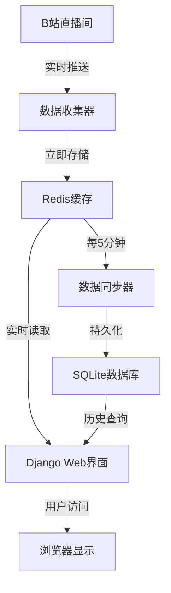
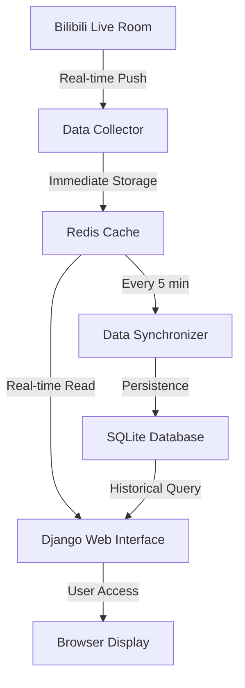

# B站直播监控系统 / Bilibili Live Monitor System

[English](#english) | [中文](#chinese)

---

## <a id="chinese"></a>🇨🇳 中文版

### 项目概述

这是一个基于Django的B站直播数据监控系统，支持实时收集弹幕、礼物数据，存储到Redis缓存和SQLite数据库，并提供Web界面进行数据可视化展示。

### 系统特性

- 🚀 **实时数据收集** - 从B站直播间实时抓取弹幕和礼物数据
- 📊 **数据可视化** - 提供图表和仪表板展示数据趋势
- 💾 **双重存储** - Redis缓存 + SQLite数据库持久化
- 🔄 **自动同步** - 定时将Redis数据同步到数据库
- 🌐 **Web界面** - 直观的管理和查看界面

### 系统架构



### 项目结构

```
bilibili-live-monitor-django/
├── manage.py                # Django项目命令行工具
├── requirements.txt         # 项目依赖包列表
├── bilibili_monitor/        # Django主应用包
│   ├── __init__.py          # Python包标识文件
│   ├── settings.py          # Django项目配置文件
│   ├── urls.py              # 项目URL路由配置
│   ├── wsgi.py              # WSGI服务器入口点
│   └── asgi.py              # ASGI服务器入口点
├── live_data/               # 直播数据处理应用
│   ├── __init__.py          # Python包标识文件
│   ├── admin.py             # Django管理后台注册
│   ├── apps.py              # 应用配置文件
│   ├── models.py            # 数据模型定义
│   ├── views.py             # 视图函数处理请求响应
│   ├── urls.py              # 应用URL路由配置
│   ├── tasks.py             # 后台任务处理
│   ├── management/          # 自定义管理命令
│   │   └── commands/
│   │       ├── sync_redis_to_db.py     # Redis数据同步命令
│   │       ├── start_sync_scheduler.py # 数据同步调度器
│   │       └── check_redis_keys.py     # Redis数据检查命令
│   ├── migrations/          # 数据库迁移文件目录
│   │   └── __init__.py      # Python包标识文件
│   └── templates/           # HTML模板文件
│       └── live_data/
│           ├── dashboard.html        # 仪表板模板
│           ├── danmaku_browser.html  # 弹幕浏览器模板
│           ├── room_list.html        # 房间列表模板
│           └── debug.html            # 调试页面模板
├── static/                  # 静态文件 (CSS, JS)
│   ├── css/
│   │   └── style.css        # 项目样式文件
│   └── js/
│       └── charts.js        # 图表可视化JavaScript代码
├── templates/               # 基础模板文件
│   └── base.html            # 基础模板，其他模板继承此文件
├── utils/                   # 工具函数模块
│   ├── __init__.py          # Python包标识文件
│   ├── bilibili_client.py   # B站API交互函数
│   ├── redis_handler.py     # Redis数据处理函数
│   └── data_processor.py    # 数据处理函数
└── README.md                # 项目文档
```

### 安装配置

#### 1. 环境要求

- **Python 3.7+**
- **Redis 服务器**
- **网络连接**（访问B站API）

#### 2. 克隆项目

```bash
git clone <repository-url>
cd bilibili-live-monitor-django
```

#### 3. 安装依赖

```bash
pip install -r requirements.txt
```

#### 4. 启动Redis服务

```bash
# Windows (如果使用Redis安装包)
redis-server

# 或使用Docker
docker run -d -p 6379:6379 redis:latest

# 检查Redis连接
redis-cli ping
# 应该返回 PONG
```

#### 5. 数据库迁移

```bash
python manage.py migrate
```

#### 6. 启动开发服务器

```bash
python manage.py runserver
```

#### 7. 访问应用

在浏览器中打开 `http://127.0.0.1:8000/live/`

### 使用教程

#### 🚀 快速开始

1. **配置监控房间**
   
   编辑 `../web_version/multi_room_collector.py` 文件，找到第787-793行：
   ```python
   # 方式2: 多个房间列表
   room_ids = [
       1962481108,  # 您要监控的房间1
       22889484,    # 您要监控的房间2
       7758258,     # 您要监控的房间3
       # 可以继续添加更多房间...
   ]
   ```

2. **启动完整系统**
   
   返回上级目录，运行一键启动脚本：
   ```bash
   cd ..
   python setup.py
   ```

3. **查看实时数据**
   
   打开浏览器访问：`http://localhost:8000/live/`

#### 📊 主要功能页面

| 页面 | URL | 功能描述 |
|------|-----|----------|
| **主仪表板** | `/live/` | 显示系统总览和实时统计 |
| **弹幕浏览器** | `/live/danmaku/` | 实时查看和搜索弹幕数据 |
| **礼物统计** | `/live/gifts/` | 查看礼物数据和统计 |
| **房间管理** | `/live/rooms/` | 管理监控的直播间 |
| **调试页面** | `/live/debug/` | 系统状态检查和调试信息 |

#### ⚙️ 管理命令

```bash
# 检查Redis数据
python manage.py check_redis_keys --pattern "room:*" --limit 10

# 手动同步数据到数据库
python manage.py sync_redis_to_db --data-type all

# 启动数据同步调度器
python manage.py start_sync_scheduler --interval 300

# 清理过期数据（可选）
python manage.py cleanup_old_data --days 7
```

#### 🔄 数据同步流程

1. **实时收集**：数据收集器从B站API获取直播数据
2. **缓存存储**：数据立即存储到Redis缓存
3. **定时同步**：每5分钟将Redis数据同步到SQLite数据库
4. **Web展示**：通过Django界面查看实时和历史数据

#### 🎯 房间选择建议

**推荐配置（人气适中，数据量合理）：**
```python
room_ids = [
    1962481108,  # 测试房间
    22889484,    # 中等人气房间
    7758258,     # 活跃但不过载的房间
]
```

**避免配置（数据量过大）：**
```python
# 不推荐 - 这些房间数据量巨大
room_ids = [
    6,        # 官方直播间 - 每分钟1000+弹幕
    17961,    # 超高人气房间 - 数据量极大
    1,        # 官方房间 - 高负载
]
```

#### 🔧 性能优化建议

- **合理选择房间**：避免监控超高人气房间
- **调整同步频率**：根据数据量调整同步间隔
- **定期清理数据**：删除过期的弹幕和礼物数据
- **监控资源使用**：注意内存和磁盘空间使用情况

### 故障排除

#### 常见问题

1. **Redis连接失败**
   ```bash
   # 检查Redis服务状态
   redis-cli ping
   
   # 如果失败，启动Redis服务
   redis-server
   ```

2. **Django启动失败**
   ```bash
   # 检查数据库迁移
   python manage.py migrate
   
   # 检查端口占用
   netstat -an | findstr 8000
   ```

3. **数据收集异常**
   - 确认房间ID正确
   - 检查网络连接
   - 查看收集器日志

4. **编码错误**
   ```bash
   # Windows系统设置UTF-8编码
   set PYTHONIOENCODING=utf-8
   python setup.py
   ```

### 贡献指南

欢迎提交Issue和Pull Request来改进项目功能和修复Bug。

---

## <a id="english"></a>🇺🇸 English Version

### Project Overview

This is a Django-based Bilibili live streaming data monitoring system that supports real-time collection of danmaku (bullet comments) and gift data, stores them in Redis cache and SQLite database, and provides a web interface for data visualization.

### System Features

- 🚀 **Real-time Data Collection** - Live crawling of danmaku and gift data from Bilibili streams
- 📊 **Data Visualization** - Charts and dashboards showing data trends
- 💾 **Dual Storage** - Redis cache + SQLite database persistence
- 🔄 **Auto Sync** - Scheduled synchronization from Redis to database
- 🌐 **Web Interface** - Intuitive management and viewing interface

### System Architecture



### Project Structure

```
bilibili-live-monitor-django/
├── manage.py                # Command-line utility for Django project
├── requirements.txt         # Project dependencies list
├── bilibili_monitor/        # Main Django application package
│   ├── __init__.py          # Python package identifier
│   ├── settings.py          # Django project configuration
│   ├── urls.py              # Project URL routing configuration
│   ├── wsgi.py              # WSGI server entry point
│   └── asgi.py              # ASGI server entry point
├── live_data/               # Live data processing application
│   ├── __init__.py          # Python package identifier
│   ├── admin.py             # Django admin backend registration
│   ├── apps.py              # Application configuration
│   ├── models.py            # Data model definitions
│   ├── views.py             # View functions for request/response handling
│   ├── urls.py              # Application URL routing configuration
│   ├── tasks.py             # Background task processing
│   ├── management/          # Custom management commands
│   │   └── commands/
│   │       ├── sync_redis_to_db.py     # Redis data sync command
│   │       ├── start_sync_scheduler.py # Data sync scheduler
│   │       └── check_redis_keys.py     # Redis data check command
│   ├── migrations/          # Database migration files directory
│   │   └── __init__.py      # Python package identifier
│   └── templates/           # HTML template files
│       └── live_data/
│           ├── dashboard.html        # Dashboard template
│           ├── danmaku_browser.html  # Danmaku browser template
│           ├── room_list.html        # Room list template
│           └── debug.html            # Debug page template
├── static/                  # Static files (CSS, JS)
│   ├── css/
│   │   └── style.css        # Project stylesheet
│   └── js/
│       └── charts.js        # Chart visualization JavaScript code
├── templates/               # Base template files
│   └── base.html            # Base template for inheritance
├── utils/                   # Utility function modules
│   ├── __init__.py          # Python package identifier
│   ├── bilibili_client.py   # Bilibili API interaction functions
│   ├── redis_handler.py     # Redis data handling functions
│   └── data_processor.py    # Data processing functions
└── README.md                # Project documentation
```

### Setup Instructions

#### 1. Requirements

- **Python 3.7+**
- **Redis server**
- **Internet connection** (to access Bilibili API)

#### 2. Clone the Repository

```bash
git clone <repository-url>
cd bilibili-live-monitor-django
```

#### 3. Install Dependencies

```bash
pip install -r requirements.txt
```

#### 4. Start Redis Service

```bash
# Windows (if using Redis installer)
redis-server

# Or using Docker
docker run -d -p 6379:6379 redis:latest

# Check Redis connection
redis-cli ping
# Should return PONG
```

#### 5. Run Database Migrations

```bash
python manage.py migrate
```

#### 6. Start Development Server

```bash
python manage.py runserver
```

#### 7. Access the Application

Open your browser and navigate to `http://127.0.0.1:8000/live/`

### Usage Tutorial

#### 🚀 Quick Start

1. **Configure Monitoring Rooms**
   
   Edit the `../web_version/multi_room_collector.py` file, find lines 787-793:
   ```python
   # Method 2: Multiple room list
   room_ids = [
       1962481108,  # Room 1 you want to monitor
       22889484,    # Room 2 you want to monitor
       7758258,     # Room 3 you want to monitor
       # You can continue adding more rooms...
   ]
   ```

2. **Start the Complete System**
   
   Go back to the parent directory and run the one-click startup script:
   ```bash
   cd ..
   python setup.py
   ```

3. **View Real-time Data**
   
   Open your browser and visit: `http://localhost:8000/live/`

#### 📊 Main Feature Pages

| Page | URL | Description |
|------|-----|-------------|
| **Main Dashboard** | `/live/` | System overview and real-time statistics |
| **Danmaku Browser** | `/live/danmaku/` | Real-time viewing and searching of danmaku data |
| **Gift Statistics** | `/live/gifts/` | View gift data and statistics |
| **Room Management** | `/live/rooms/` | Manage monitored live rooms |
| **Debug Page** | `/live/debug/` | System status check and debug information |

#### ⚙️ Management Commands

```bash
# Check Redis data
python manage.py check_redis_keys --pattern "room:*" --limit 10

# Manually sync data to database
python manage.py sync_redis_to_db --data-type all

# Start data sync scheduler
python manage.py start_sync_scheduler --interval 300

# Clean up expired data (optional)
python manage.py cleanup_old_data --days 7
```

#### 🔄 Data Sync Workflow

1. **Real-time Collection**: Data collector fetches live data from Bilibili API
2. **Cache Storage**: Data is immediately stored in Redis cache
3. **Scheduled Sync**: Redis data is synced to SQLite database every 5 minutes
4. **Web Display**: View real-time and historical data through Django interface

#### 🎯 Room Selection Recommendations

**Recommended Configuration (Moderate popularity, reasonable data volume):**
```python
room_ids = [
    1962481108,  # Test room
    22889484,    # Medium popularity room
    7758258,     # Active but not overloaded room
]
```

**Avoid Configuration (Excessive data volume):**
```python
# Not recommended - These rooms have massive data volume
room_ids = [
    6,        # Official live room - 1000+ danmaku per minute
    17961,    # Extremely popular room - Massive data volume
    1,        # Official room - High load
]
```

#### 🔧 Performance Optimization Tips

- **Choose Rooms Wisely**: Avoid monitoring extremely popular rooms
- **Adjust Sync Frequency**: Modify sync intervals based on data volume
- **Regular Data Cleanup**: Delete expired danmaku and gift data
- **Monitor Resource Usage**: Keep an eye on memory and disk space usage

### Troubleshooting

#### Common Issues

1. **Redis Connection Failed**
   ```bash
   # Check Redis service status
   redis-cli ping
   
   # If failed, start Redis service
   redis-server
   ```

2. **Django Startup Failed**
   ```bash
   # Check database migrations
   python manage.py migrate
   
   # Check port usage
   netstat -an | findstr 8000
   ```

3. **Data Collection Errors**
   - Verify room IDs are correct
   - Check network connection
   - Review collector logs

4. **Encoding Errors**
   ```bash
   # Set UTF-8 encoding for Windows systems
   set PYTHONIOENCODING=utf-8
   python setup.py
   ```

### Contributing

Feel free to submit issues and pull requests to improve functionality and fix bugs.

---

## License

This project is open source. Please refer to the LICENSE file for details.

## Contact

For questions or support, please create an issue in the repository.